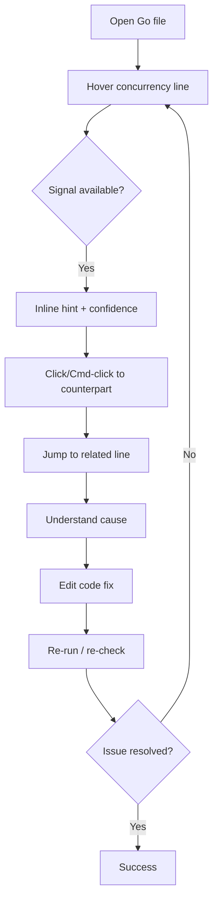
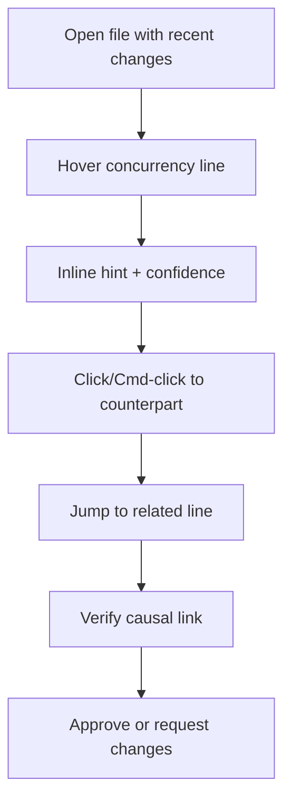

# UX Design Specification goide

**Author:** sungp
**Date:** 2026-04-08T11:29:48.5396593+07:00

---

<!-- UX design content will be appended sequentially through collaborative workflow steps -->
## Executive Summary

### Project Vision

goide is a Go-first IDE focused on in-editor concurrency debugging through the Concurrency Lens (Invisible Runtime UX). The experience is editor-first and minimal by default: signals appear only on intent (hover/click/trace), and the UI avoids dashboards, noise, or heavy workflows. The MVP prioritizes single-file reliability, fast time-to-resolution, and graceful fallback to static hints when runtime signals are unavailable.

### Target Users

- Primary: Intermediate to advanced Go developers working on concurrent backend/microservices systems.
- Secondary: General Go developers who occasionally hit concurrency issues but need fast, reliable guidance.
- Users understand goroutines and channels, but many are not comfortable with deeper trace tooling.

### Key Design Challenges

- Make “who is waiting on whom” obvious without forcing users to leave the editor.
- Surface accurate signals without noise or flicker; prefer silence over misleading cues.
- Preserve editor flow on small screens (13–16 inch) while keeping overlays readable and lightweight.
- Minimize configuration and setup friction; value immediate usefulness in the first minute.

### Design Opportunities

- Deliver the “aha” moment: hover → see block cause → click → jump to counterpart.
- Replace external trace tools with a native, in-context explanation of runtime behavior.
- Build trust through clarity: confidence labels, minimal motion, stable overlay behavior.

## Core User Experience

### Defining Experience

The core experience is “hover to understand.” Users frequently hover over a concurrency line to instantly see what’s happening, then click (or Cmd‑click) to jump to the counterpart operation. The single most important interaction to nail is hover → immediate explanation in place. If this feels effortless and accurate, the product delivers its value.

### Platform Strategy

- Tauri desktop app for macOS, Linux, and Windows
- Mouse + keyboard only (no touch)
- Fully offline/local-first with no network dependency
- Must feel fast on typical developer machines

### Effortless Interactions

- Hover to reveal hints with no perceived delay
- Click/Cmd‑click to jump to counterpart instantly
- Enable Deep Trace from inline action without friction
- Static hints available without running code
- Runtime signals upgrade automatically when active (Predicted → Likely → Confirmed)

### Critical Success Moments

- “This is better”: hover a blocked channel and immediately see why it’s blocked without logs or trace tools
- Trust-breaking failure: incorrect/misleading causal relationships
- First-time success flow: open file → hover → see issue → click → jump → understand → fix

### Experience Principles

- Editor-first, low-noise, instant feedback
- Prefer accuracy and trust over showing more
- Local-first and fast by default
- Make the hover → explain → jump loop frictionless

## Desired Emotional Response

### Primary Emotional Goals

- Clarity and calm: understand what’s happening without stress
- Confidence and control: no guessing or blind debugging
- Trust in signals: accuracy over frequency

### Emotional Journey Mapping

- First discovery: curiosity — “this looks simple but interesting”
- Core experience: immediate clarity → growing confidence
- After success: relief + satisfaction — “that was easier than expected”
- When runtime fails: still useful, not broken — “static hints still help”
- Returning later: trust — “this tool reliably helps me understand issues”

### Micro-Emotions

**Critical**
- Clarity
- Confidence
- Trust
- Calm

**Secondary**
- Relief
- Satisfaction

**Avoid**
- Confusion
- Mistrust from wrong signals
- Noise/overload
- Anxiety from flicker or instability

### Design Implications

- Prefer accurate signals over frequent signals (no signal > wrong signal)
- Stable, non-flickering visuals
- Immediate feedback on hover (no perceived delay)
- Clear confidence levels (Predicted / Likely / Confirmed)
- Minimal UI that never competes with the code

### Emotional Design Principles

- Make understanding feel effortless and safe
- Build trust through consistency and restraint
- Keep focus on the code, not the UI

## UX Pattern Analysis & Inspiration

### Inspiring Products Analysis

**Visual Studio Code**
- Strengths: familiar, predictable layout; fast navigation; minimal friction; stable and reliable feel
- Compelling: “I can do everything I need without thinking”
- Retention: reliability and familiarity

**Raycast**
- Strengths: instant interactions; command-first UX; clean minimal UI; high responsiveness
- Compelling: “Everything happens instantly”
- Retention: speed and efficiency

**Linear**
- Strengths: clean, calm interface; subtle meaningful motion; high polish; consistent patterns
- Compelling: “Everything feels smooth, calm, and intentional”
- Retention: clarity and polish

### Transferable UX Patterns

- VS Code: IDE shell layout (sidebar + editor + status bar), predictable navigation
- Raycast: instant feedback + command palette patterns for fast actions
- Linear: subtle, stable motion and calm visual rhythm

### Anti-Patterns to Avoid

- VS Code: extension complexity and UI clutter
- Raycast: over-reliance on keyboard-only workflows
- Linear: over-polish that adds unnecessary complexity

### Design Inspiration Strategy

**Adopt**
- VS Code layout familiarity to reduce learning friction
- Raycast-style instant feedback for hover/click interactions
- Linear’s calmness and subtle motion for trust and clarity

**Adapt**
- Command palette patterns from Raycast, but balanced with mouse/hover workflows
- Linear’s polish, but focused on stability over visual flourish

**Avoid**
- Extension complexity and clutter
- Keyboard-only assumptions
- Polishing that risks speed or simplicity

**Guiding principle**
Combine VS Code familiarity, Raycast speed, and Linear calmness without inheriting their complexity.

## Design System Foundation

### 1.1 Design System Choice

Custom design system built with Tailwind only. Design tokens come first, and components are bespoke for the IDE shell and Concurrency Lens overlays.

### Rationale for Selection

- Lightweight, editor-first UI with minimal noise
- Precise control over subtle state distinctions (Predicted / Likely / Confirmed)
- Avoids heavy framework styling and component overhead
- Allows components to feel native to a code editor, not a SaaS dashboard

### Implementation Approach

- Tailwind-only styling with a token-driven layer (colors, spacing, radii, typography, motion)
- Build bespoke components for shell, overlays, and interaction primitives
- Maintain strict visual restraint: calm, dark, high-contrast, developer-focused

### Customization Strategy

- Theme: Catppuccin Mocha
- Code font: JetBrains Mono
- UI tone: minimal, polished, low-noise
- Use soft contrast (no neon), subtle informative motion only
- Shapes: rounded-small or sharp-soft hybrid (avoid playful styling)

## 2. Core User Experience

### 2.1 Defining Experience

The defining action: “I hover over a line and instantly understand why it’s blocked.” If we perfect hover → immediate, accurate explanation of concurrency state, the product succeeds.

### 2.2 User Mental Model

- Current approach: logs + go tool trace/pprof + manual reconstruction across tools/files
- Mental model: “Find the blocked goroutine and the one that can unblock it”
- Confusion points: unclear responsibility, lost context across tools, misinterpreting trace data

### 2.3 Success Criteria

- “This just works” when hover reveals a clear, immediate explanation
- Feedback: inline signals (pulse, trace bubble, causal link) + confidence labels
- Speed: hover response <100ms; click/jump feels instant
- Automatic behavior: static hints always present; runtime signals upgrade automatically

### 2.4 Novel UX Patterns

- Built on familiar patterns (hover, click, jump)
- Novelty comes from new information appearing inline, not new controls
- Metaphor: “The code reveals its runtime behavior when you look at it”

### 2.5 Experience Mechanics

**Initiation**
- Open file → hover a concurrency-related line

**Interaction**
- Hover → see explanation
- Click/Cmd‑click → jump to counterpart
- Enable Deep Trace if needed

**Feedback**
- Inline visual signals: dotted hint (predicted), pulse (blocked), thread line (causal link), trace bubble (details + confidence)
- Stable, non‑flickering updates

**Completion**
- User understands issue and identifies fix
- Next: edit code, re‑run, optionally re‑check with Deep Trace

## Visual Design Foundation

### Color System

- Base palette: official Catppuccin Mocha values (no heavy customization)
- UI uses low‑noise contrasts with soft, calm surfaces
- Signal accents:
  - Predicted: subtle gray/low‑contrast overlay
  - Likely: soft blue
  - Confirmed: Catppuccin green or yellow (contextual)
  - Blocked: muted soft red (not aggressive)
  - Warning/Contention: peach or yellow (Catppuccin palette)
- All UI text targets WCAG AA contrast

### Typography System

- Code font: JetBrains Mono
- UI font: Geist or IBM Plex Sans (avoid Inter/Roboto)
- Base UI font size: 13px (compact, IDE‑appropriate)
- Typographic tone: calm, modern, developer‑focused

### Spacing & Layout Foundation

- Density: compact, IDE‑like layout
- Spacing system: 4px base unit
- Border radius: 4px (subtle, not rounded‑heavy)
- Layout bias: editor‑first, low‑noise, minimal panels

### Accessibility Considerations

- WCAG AA contrast for all UI text
- Respect reduced‑motion preferences (disable pulse/animations)
- Signals must be distinguishable without color alone (shape/pattern + color)

## Design Direction Decision

### Design Directions Explored

We explored lightweight IDE shell directions emphasizing editor dominance and minimal overlays, plus an optional right summary panel.

### Chosen Direction

- Primary: A. Calm Baseline (editor‑dominant, minimal shell)
- Secondary: E. Summary Peek (optional, collapsible right panel)

### Design Rationale

- Editor remains 70–80% width to preserve focus
- Summary panel collapsed by default, text‑first with simple indicators only
- Overlays stay inline and minimal; no persistent panels beyond sidebar + status bar
- Interaction remains fast and low‑noise

### Implementation Approach

- Editor‑first layout with optional right panel
- Summary panel only on explicit toggle
- Inline Concurrency Lens overlays only; no dashboard workflows

## User Journey Flows

### 1) Debugging a Hang (Happy Path)

**Goal:** Resolve a blocking issue inside a single file using hover → explain → jump → fix.



### 2) Signal Degradation (Runtime Fails → Static Hints)

**Goal:** Preserve trust and utility when runtime sampling is unavailable.

```mermaid
flowchart TD
  A[Hover concurrency line] --> B{Runtime available?}
  B -->|No| C[Show static hint (Predicted)]
  C --> D[Confidence label visible]
  D --> E[Optional click to counterpart]
  E --> F[Jump to related line]
  F --> G[Understand likely cause]
  G --> H[Fix or continue]
```

### 3) Code Review Validation

**Goal:** Validate a concurrency fix quickly during review.



### Journey Patterns

- Entry always via hover on a concurrency line
- Inline signals are minimal and confidence-labeled
- Jump navigation is the primary action after hover
- Single-file scope maintained to reduce complexity

### Flow Optimization Principles

- Optimize time-to-insight: hover response <100ms
- Prefer accurate signals over noisy ones
- Keep interactions local to the code surface
- Avoid extra panels unless explicitly toggled

## Component Strategy

### Design System Components

**Foundation components (Tailwind-based)**
- Buttons (primary, subtle, ghost)
- Icon button
- Input / search field
- Tooltip / hover card
- Popover / menu
- Context menu (right-click)
- Command palette input (first-class)
- Tabs
- Badge / tag
- Status pill
- Toggle / switch
- Divider / separator
- Scroll container (smooth, editor-like)

### Custom Components

**Core shell**
- Code Editor Shell (container + gutters) — highest priority
- Source Tree (file explorer)
- Editor Tabs (multi-file support)
- Gutter Layer (line numbers + trace anchors)
- Right Summary Panel (collapsible; optional)
- Runtime Status Strip (status bar element)

**Concurrency Lens**
- Concurrency Lens Overlay Layer — highest priority
- Hint Underline (predicted)
- Block Pulse (blocked signal)
- Causal Thread Line
- Trace Bubble (wait time + confidence)
- Confidence Chip (Predicted / Likely / Confirmed)
- Density Guard Indicator
- Inline Quick Actions (Deep Trace, Jump)

**Fallback / advanced**
- Empty / No-signal state (explicit fallback UI)
- Trace Ribbon (temporal scrub) — Phase 2
- Conflict Vector (deadlock risk visualization) — Phase 2

### Component Implementation Strategy

- Build all components on shared tokens (color, spacing, motion, radii)
- Keep overlay components extremely lightweight and fast
- Inline quick actions only on hover/selection
- Summary panel optional and collapsed by default
- Avoid dashboard-like components or persistent panels

### Implementation Roadmap

**Phase 1 — Core Experience**
- Code Editor Shell + Concurrency Lens Overlay Layer
- Hint Underline, Block Pulse, Trace Bubble
- Gutter Layer + Runtime Status Strip

**Phase 2 — Supporting**
- Source Tree, Editor Tabs
- Confidence Chip, Density Guard Indicator
- Inline Quick Actions

**Phase 3 — Expansion**
- Trace Ribbon (temporal scrub)
- Conflict Vector (deadlock risk visualization)

### Component States

- Default / hover / active / disabled
- Runtime available vs unavailable
- Predicted vs likely vs confirmed
- Loading / resolving (short-lived, no spinners)
- Error / degraded (fallback to static)
- Focused vs non-focused (dim unrelated code)

## UX Consistency Patterns

### Feedback Patterns (Priority 1)

**When to Use**
- Runtime signals: Predicted / Likely / Confirmed
- Blocked vs contention vs warning states
- Fallback to static hints when runtime unavailable

**Visual Design**
- Predicted: subtle gray underline/overlay
- Likely: soft blue accent
- Confirmed: Catppuccin green or yellow (contextual)
- Blocked: muted soft red pulse
- Warning/Contention: peach/yellow

**Behavior**
- Prefer no signal over wrong signal
- Confidence labels always visible on inline signals
- Signals update smoothly (no flicker)
- Dimming of unrelated signals on focus/hover

**Accessibility**
- Use shape/pattern + color (not color alone)
- WCAG AA for text labels
- Reduce motion if user prefers reduced motion

### Overlay Patterns (Priority 1)

**When to Use**
- Hover on concurrency line → show hint + confidence
- Selection/click → show inline actions (Jump, Deep Trace)

**Visual Design**
- Inline overlays only; no modal overlays
- Trace bubble compact, text‑first, single‑line where possible
- Inline actions appear only on hover/selection

**Behavior**
- Hover response <100ms
- Inline actions disappear on blur/hover out
- Overlay density guard caps visible signals per viewport

**Accessibility**
- Keyboard focus states mirror hover
- Actions reachable via keyboard (Tab/Enter)

### Navigation Patterns (Priority 2)

**Sidebar + Tabs**
- Familiar IDE layout (sidebar + editor + status bar)
- Tabs for multi‑file; editor remains dominant

**Command Palette**
- Raycast‑style, instant response
- Opens with standard shortcut (Cmd/Ctrl+K)

**Jump‑to‑Counterpart**
- Primary action after hover
- Cmd/Ctrl‑click as direct shortcut
- Always stays within single‑file scope in MVP

### Empty / Loading / Degraded States (Priority 3)

**Empty**
- Clear “No signals yet” message (low‑noise)
- Explain how to trigger signals (hover, enable Deep Trace)

**Loading / Resolving**
- Short‑lived state; avoid spinners
- Subtle “resolving” indicator near inline hint

**Degraded**
- Runtime unavailable → static hints + Predicted label
- Communicate fallback subtly, without error framing

### Button Hierarchy & Action Placement (Priority 4)

**Hierarchy**
- Primary actions minimal and inline (Jump, Deep Trace)
- Secondary actions hidden unless relevant

**Placement**
- Actions appear only at point of intent (hover/selection)
- Avoid global action bars or persistent controls

## Responsive Design & Accessibility

### Responsive Strategy

- Desktop‑only for MVP (no tablet/mobile layouts)
- Fluid desktop layout with behavior thresholds, not full redesigns

### Breakpoint Strategy

- Use practical width thresholds to adjust behavior:
  - Auto‑collapse right summary panel on narrow widths
  - Sidebar reduces visual weight but source tree stays accessible
  - Editor remains dominant in all widths

### Accessibility Strategy

- Target WCAG AA for UI text and essential controls
- Reduced‑motion support (disable pulse/animations when requested)
- Signals distinguishable without color alone (shape/pattern + color)

### Testing Strategy

- Keyboard navigation testing
- Contrast checks
- Reduced motion verification
- Basic VoiceOver support if feasible

### Implementation Guidelines

- Ensure hover interactions have keyboard equivalents:
  - Focus reveals same hint as hover
  - Keyboard actions can trigger Jump / Deep Trace
- Maintain clear focus indicators in editor and overlays
- Keep essential controls reachable without mouse

