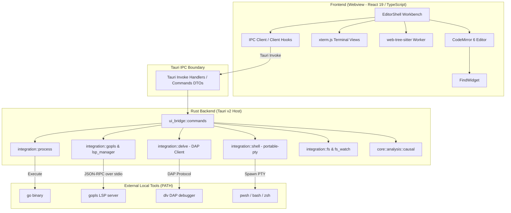
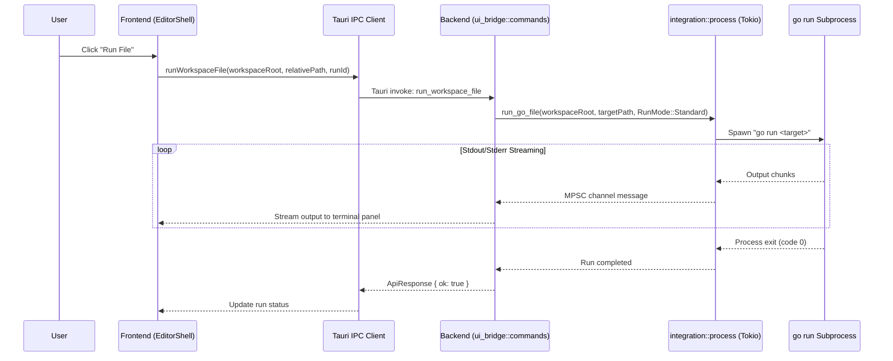

# GoIDE System Architecture

This document describes the real architecture of GoIDE as implemented in the codebase.

---

## 1. System Overview

GoIDE is structured into two primary tiers:
1. **Frontend Tier (Webview)**: A React 19 and TypeScript application that manages the workbench UI, CodeMirror editor, terminal views, and user interactions.
2. **Backend Tier (Native Host)**: A Rust application powered by Tauri v2 that owns operating system interactions, process execution, PTY sessions, file operations, and developer tooling bridges (`gopls`, `dlv`).

Communication between tiers is strictly mediated through **typed Tauri IPC commands** returning structured `ApiResponse<T>` envelopes.



---

## 2. Frontend Architecture

### Technology Stack
- **Framework**: React 19, TypeScript (~5.8), Vite 7
- **Styling**: Tailwind CSS v4, custom CSS variables in `src/styles/global.css`
- **Editor**: CodeMirror 6 via `@uiw/react-codemirror`, `@codemirror/lang-go`, `@codemirror/state`, `@codemirror/view`
- **Terminal**: `@xterm/xterm` with `@xterm/addon-fit`
- **AST Parsing**: `@vscode/tree-sitter-wasm` and `web-tree-sitter` in a dedicated Web Worker (`src/features/semantics/semanticAnalysisWorker.ts`)

### Key Components & Layout
- **`src/components/editor/EditorShell.tsx`**: The root workbench component coordinating panels, sidebar, status bar, and active editor state.
- **`src/components/editor/useBranchTransition.ts`**: Owns the active-buffer save, Git status inspection, explicit dirty-worktree decision, checkout and reload transaction. Shares the document-transition lock with file/workspace navigation; a synchronous mutation ref guards editor callbacks before the read-only render. Failed saves/new edits prevent checkout, and disk reload never routes through a post-checkout buffer save. Native Git invocation remains behind typed backend IPC.
- **`src/components/editor/CodeEditor.tsx`**: CodeMirror 6 wrapper integrating bracket matching, syntax highlighting, gutter markers, hover hints, and inline trace indicators.
- **`src/components/editor/FindWidget.tsx`**: Integrated search-and-replace overlay inside the active editor supporting case matching, whole-word matching, and regex queries.
- **`src/components/panels/BottomPanel.tsx`**: Tabbed dock hosting Shell Terminal, Process Logs, Run Output, Workspace Search, Git Status, and Runtime Topology.
- **`src/components/sidebar/Explorer.tsx`**: Hierarchical filesystem tree with dirty file state badges and context actions.
- **`src/components/statusbar/StatusBar.tsx`**: Real-time toolchain health indicators (`go`, `gopls`, `dlv`), active symbol breadcrumb, Git branch name, and cursor location.

---

## 3. Rust Backend Architecture

Located in `src-tauri/src/`:

### Core Modules
- **`lib.rs`**: Application entry point initializing Tauri plugins (`tauri-plugin-dialog`, `tauri-plugin-opener`) and registering 38 invoke command handlers.
- **`ui_bridge/`**:
  - `commands.rs`: IPC command handlers receiving JSON payloads from the frontend, validating arguments, and dispatching to integration services.
  - `types.rs`: Strongly typed Serde request and response data transfer objects (DTOs).
- **`integration/`**:
  - `process.rs`: Manages execution of `go run` and `go run -race`. Spawns child processes, streams stdout/stderr asynchronously via Tokio channels, and enforces process termination (`kill_process_group`).
  - `shell.rs`: PTY-based shell manager using `portable-pty`. Maintains persistent terminal sessions mapped to workspace roots across editor file changes.
  - `gopls.rs` & `lsp_manager.rs`: Implements JSON-RPC 2.0 communication over stdin/stdout with `gopls`, supporting document synchronization (`didOpen`, `didChange`), completions, and diagnostics. File URIs use URL encoding for spaces, reserved characters, Unicode, and Windows canonical/UNC paths. Sessions own their child and reader thread; replacement, initialization failure, and app exit terminate/reap the child and join the reader. Incoming messages use a bounded queue and a 16 MiB frame limit; a disconnected reader fails requests immediately. Failed completion connections are released so the next request can initialize and resync a fresh server. Completion failures are reported if both LSP and the legacy CLI fallback fail. This is a limited LSP client; server-initiated requests are not fully implemented.
  - `delve.rs`: Debug Adapter Protocol (DAP) client communicating with `dlv dap`. Normalizes breakpoint synchronization, stepping, and runtime variable/goroutine snapshots.
  - `fs.rs` & `fs_watch.rs`: Workspace-scoped enumeration, atomic file writes, and guarded entry mutations. Delete/rename/move reject the workspace root and traversal aliases, and operate on symlink entries rather than their referents. The Tauri-managed filesystem-sync service uses `notify` OS watchers, with 900 ms polling on native startup/runtime failure. Snapshot reconciliation uses entry type, file size and modification time; scans run on blocking workers, exclude generated trees, and never follow links. Polling cannot identify content edits that preserve both size and modification time.
- **`core/analysis/`**:
  - `causal.rs`: Analyzes runtime signal correlation, computing confidence scores for counterpart channel operations (e.g. channel send vs. receive pairing).

---

## 4. IPC & Command Boundary

Frontend command functions in `src/lib/ipc/client.ts` call Tauri's `invoke<ApiResponse<T>>` directly with command-specific typed arguments and results. There is currently no shared `apiInvoke<T>` wrapper. The response envelope is:

```typescript
export type ApiResponse<T> = {
  ok: boolean;
  data?: T;
  error?: ApiError;
};
```

### IPC Data Flow Example: Running a Go File



---

## 5. State Ownership Model

To prevent state desynchronization and race conditions:
1. **Workbench & Editor UI State**: Owned exclusively by the React application state (`useWorkspaceLayout`, `useCompletionState`, `useDiagnosticsState`, `useRunOutputState`).
2. **Process & Tooling State**: Owned exclusively by the Rust backend using thread-safe state stores (`OnceLock<ProcessHandle>`, `OnceLock<Arc<Mutex<Option<DapSessionHandle>>>>`).
3. **Filesystem as Source of Truth**: The disk remains the single source of truth for file contents. The frontend tracks a dirty buffer state in memory and coordinates saves through atomic `write_workspace_file` commands.
4. **Filesystem Sync**: Tauri owns `FsWatchService`. A workspace shares one watcher/task across independent subscription IDs; `stop_workspace_fs_watch` releases only the caller's subscription. `useWorkspaceFsSync` subscribes before startup and serializes startup/cleanup across workspace changes. App exit stops every watcher and prevents late startup. Filesystem events refresh Explorer; they do not overwrite active editor buffers.

---

## 6. Technical Debt & Architectural Opportunities

We document the following architectural debt for future stabilization phases:

1. **Monolithic `ui_bridge/commands.rs`**: At over 3,400 lines, this file concentrates too many disparate responsibilities (filesystem, Git, terminal, debugger, LSP). It should be refactored into focused submodules (`fs_commands.rs`, `debug_commands.rs`, `terminal_commands.rs`, `lsp_commands.rs`).
2. **Global Singletons**: Backend process and debugger handles currently rely on process-global `OnceLock` singletons. This design limits multi-window or multi-workspace scaling. Introducing a proper Tauri managed state (`tauri::State<AppState>`) will enhance testability and isolation.
3. **Heuristic Concurrency Correlation**: Causal channel pairing in `causal.rs` relies on heuristic correlation scoring rather than exact Go SSA static analysis. Integrating Go compiler SSA analysis will improve confidence accuracy.
4. **Terminal Input Latency under Heavy Output**: High-throughput terminal streaming can contend with UI rendering threads. Implementing bounded batching and offscreen terminal rendering buffers will improve responsiveness.

## Source Control and Document Safety Domains

New Git logic lives in `integration/git/` (machine-readable status, literal paths, bounded process output, per-repository mutation/cancellation, diff/history/commit metadata) and `ui_bridge/git_commands.rs`. React uses typed `src/lib/ipc/git.ts` and `src/features/git/`; shared document transactions guard disk-changing actions. The develop custom graph renderer consumes the deterministic domain model instead of parsing ASCII graph art. History pages pin object tips and are bounded to 100 commits per page/2,000 rendered-view commits; output beyond safe limits requires the repository terminal. Existing snapshot APIs remain compatibility adapters.

`integration/document.rs` compares the known disk baseline before existing-file atomic replacement and distinguishes missing files from read failures. The frontend external-file hook keeps editor and disk content separate. `useExplorerDocumentTransaction` and `useSafeWindowClose` guard affected editor identities, save failures and native close/quit. `integration/lifecycle.rs` prevents process registration racing final teardown. This remains a single-window/process-global lifecycle model; descendant ownership and native behavior require platform evidence, and optimistic disk checks do not lock unrelated external applications.

## Native Search and Process Boundaries

Workspace Search and replacement preview live in dedicated integration/IPC modules. Search returns explicit scope/limit information, supports cancellation before and after worker registration, and does not parse shell output. Replacement uses the same native matcher, prepares complete before/after baselines without writing, and applies through the document transaction with optimistic conflict checks. Batches stop on failure and report the saved prefix rather than claiming atomic multi-file transactions.

On Windows, an app-lifetime unnamed job is installed before Tauri/tool launch so normally inherited descendants remain owned even after a parent exits. Git commands additionally retain their own nested job through process/output teardown. Job handles are not inherited by descendants. Other operating systems retain process groups and require their own native validation. Retained conflict-result drafts have workspace/file identity and are included in close/workspace preservation; ordinary multi-document editor ownership remains separate unfinished work.

## Owned Run and Debug Children

The process boundary wraps Go Run and Delve children in OwnedChild. Each run has an immutable UUID separate from its OS PID. Completion checks that identity before retiring the shared handle. On Windows, per-child jobs complement the application job; Unix callers spawn a process group and cleanup targets that group. Output draining uses bounded UTF-8 chunks, and DAP framing limits headers to 16 KiB and bodies to 16 MiB. The output delivery budget is 2 MiB per stream; excess output is still drained. Native lifecycle and platform validation remain release requirements.
