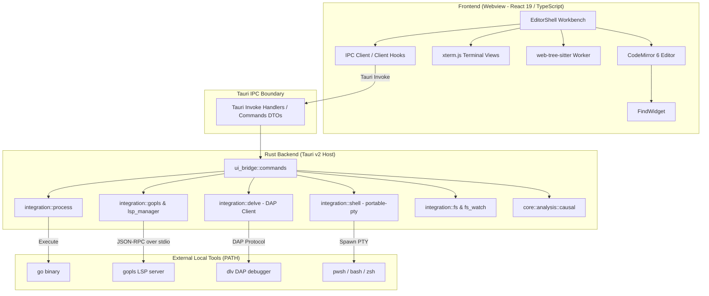
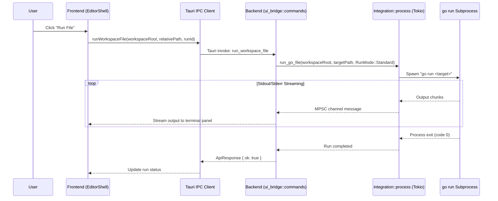

# GoIDE System Architecture

This document describes the real architecture of GoIDE as implemented in the codebase.

---

## 1. System Overview

GoIDE is structured into two primary tiers:
1. **Frontend Tier (Webview)**: A React 19 and TypeScript application that manages the workbench UI, CodeMirror editor, terminal views, and user interactions.
2. **Backend Tier (Native Host)**: A Rust application powered by Tauri v2 that owns operating system interactions, process execution, PTY sessions, file operations, and developer tooling bridges (`gopls`, `dlv`).

Communication between tiers is strictly mediated through **typed Tauri IPC commands** returning structured `ApiResponse<T>` envelopes.



---

## 2. Frontend Architecture

### Technology Stack
- **Framework**: React 19, TypeScript (~5.8), Vite 7
- **Styling**: Tailwind CSS v4, custom CSS variables in `src/styles/global.css`
- **Editor**: CodeMirror 6 via `@uiw/react-codemirror`, `@codemirror/lang-go`, `@codemirror/state`, `@codemirror/view`
- **Terminal**: `@xterm/xterm` with `@xterm/addon-fit`
- **AST Parsing**: `@vscode/tree-sitter-wasm` and `web-tree-sitter` in a dedicated Web Worker (`src/features/semantics/semanticAnalysisWorker.ts`)

### Key Components & Layout
- **`src/components/editor/EditorShell.tsx`**: The root workbench component coordinating panels, sidebar, status bar, and active editor state.
- **`src/components/editor/useBranchTransition.ts`**: Owns the active-buffer save, Git status inspection, explicit dirty-worktree decision, checkout and reload transaction. Shares the document-transition lock with file/workspace navigation; a synchronous mutation ref guards editor callbacks before the read-only render. Failed saves/new edits prevent checkout, and disk reload never routes through a post-checkout buffer save. Native Git invocation remains behind typed backend IPC.
- **`src/components/editor/CodeEditor.tsx`**: CodeMirror 6 wrapper integrating bracket matching, syntax highlighting, gutter markers, hover hints, and inline trace indicators.
- **`src/components/editor/FindWidget.tsx`**: Integrated search-and-replace overlay inside the active editor supporting case matching, whole-word matching, and regex queries.
- **`src/components/panels/BottomPanel.tsx`**: Tabbed dock hosting Shell Terminal, Process Logs, Run Output, Workspace Search, Git Status, and Runtime Topology.
- **`src/components/sidebar/Explorer.tsx`**: Hierarchical filesystem tree with dirty file state badges and context actions.
- **`src/components/statusbar/StatusBar.tsx`**: Real-time toolchain health indicators (`go`, `gopls`, `dlv`), active symbol breadcrumb, Git branch name, and cursor location.

---

## 3. Rust Backend Architecture

Located in `src-tauri/src/`:

### Core Modules
- **`lib.rs`**: Application entry point initializing Tauri plugins (`tauri-plugin-dialog`, `tauri-plugin-opener`) and registering 38 invoke command handlers.
- **`ui_bridge/`**:
  - `commands.rs`: IPC command handlers receiving JSON payloads from the frontend, validating arguments, and dispatching to integration services.
  - `types.rs`: Strongly typed Serde request and response data transfer objects (DTOs).
- **`integration/`**:
  - `process.rs`: Manages execution of `go run` and `go run -race`. Spawns child processes, streams stdout/stderr asynchronously via Tokio channels, and enforces process termination (`kill_process_group`).
  - `shell.rs`: PTY-based shell manager using `portable-pty`. Maintains persistent terminal sessions mapped to workspace roots across editor file changes.
  - `gopls.rs` & `lsp_manager.rs`: Implements JSON-RPC 2.0 communication over stdin/stdout with `gopls`, supporting document synchronization (`didOpen`, `didChange`), completions, and diagnostics. File URIs use URL encoding for spaces, reserved characters, Unicode, and Windows canonical/UNC paths. Sessions own their child and reader thread; replacement, initialization failure, and app exit terminate/reap the child and join the reader. Incoming messages use a bounded queue and a 16 MiB frame limit; a disconnected reader fails requests immediately. Failed completion connections are released so the next request can initialize and resync a fresh server. Completion failures are reported if both LSP and the legacy CLI fallback fail. This is a limited LSP client; server-initiated requests are not fully implemented.
  - `delve.rs`: Debug Adapter Protocol (DAP) client communicating with `dlv dap`. Normalizes breakpoint synchronization, stepping, and runtime variable/goroutine snapshots.
  - `fs.rs` & `fs_watch.rs`: Workspace-scoped enumeration, atomic file writes, and guarded entry mutations. Delete/rename/move reject the workspace root and traversal aliases, and operate on symlink entries rather than their referents. The Tauri-managed filesystem-sync service uses `notify` OS watchers, with 900 ms polling on native startup/runtime failure. Snapshot reconciliation uses entry type, file size and modification time; scans run on blocking workers, exclude generated trees, and never follow links. Polling cannot identify content edits that preserve both size and modification time.
- **`core/analysis/`**:
  - `causal.rs`: Analyzes runtime signal correlation, computing confidence scores for counterpart channel operations (e.g. channel send vs. receive pairing).

---

## 4. IPC & Command Boundary

Frontend command functions in `src/lib/ipc/client.ts` call Tauri's `invoke<ApiResponse<T>>` directly with command-specific typed arguments and results. There is currently no shared `apiInvoke<T>` wrapper. The response envelope is:

```typescript
export type ApiResponse<T> = {
  ok: boolean;
  data?: T;
  error?: ApiError;
};
```

### IPC Data Flow Example: Running a Go File



---

## 5. State Ownership Model

To prevent state desynchronization and race conditions:
1. **Workbench & Editor UI State**: Owned exclusively by the React application state (`useWorkspaceLayout`, `useCompletionState`, `useDiagnosticsState`, `useRunOutputState`).
2. **Process & Tooling State**: Owned exclusively by the Rust backend using thread-safe state stores (`OnceLock<ProcessHandle>`, `OnceLock<Arc<Mutex<Option<DapSessionHandle>>>>`).
3. **Filesystem as Source of Truth**: The disk remains the single source of truth for file contents. The frontend tracks a dirty buffer state in memory and coordinates saves through atomic `write_workspace_file` commands.
4. **Filesystem Sync**: Tauri owns `FsWatchService`. A workspace shares one watcher/task across independent subscription IDs; `stop_workspace_fs_watch` releases only the caller's subscription. `useWorkspaceFsSync` subscribes before startup and serializes startup/cleanup across workspace changes. App exit stops every watcher and prevents late startup. Filesystem events refresh Explorer; they do not overwrite active editor buffers.

---

## 6. Technical Debt & Architectural Opportunities

We document the following architectural debt for future stabilization phases:

1. **Monolithic `ui_bridge/commands.rs`**: At over 3,400 lines, this file concentrates too many disparate responsibilities (filesystem, Git, terminal, debugger, LSP). It should be refactored into focused submodules (`fs_commands.rs`, `debug_commands.rs`, `terminal_commands.rs`, `lsp_commands.rs`).
2. **Global Singletons**: Backend process and debugger handles currently rely on process-global `OnceLock` singletons. This design limits multi-window or multi-workspace scaling. Introducing a proper Tauri managed state (`tauri::State<AppState>`) will enhance testability and isolation.
3. **Heuristic Concurrency Correlation**: Causal channel pairing in `causal.rs` relies on heuristic correlation scoring rather than exact Go SSA static analysis. Integrating Go compiler SSA analysis will improve confidence accuracy.
4. **Terminal Input Latency under Heavy Output**: High-throughput terminal streaming can contend with UI rendering threads. Implementing bounded batching and offscreen terminal rendering buffers will improve responsiveness.

## Source Control and Document Safety Domains

New Git logic lives in `integration/git/` (machine-readable status, literal paths, bounded process output, per-repository mutation/cancellation, diff/history/commit metadata) and `ui_bridge/git_commands.rs`. React uses typed `src/lib/ipc/git.ts` and `src/features/git/`; shared document transactions guard disk-changing actions. The develop custom graph renderer consumes the deterministic domain model instead of parsing ASCII graph art. History pages pin object tips and are bounded to 100 commits per page/2,000 rendered-view commits; output beyond safe limits requires the repository terminal. Existing snapshot APIs remain compatibility adapters.

`integration/document.rs` compares the known disk baseline before existing-file atomic replacement and distinguishes missing files from read failures. The frontend external-file hook keeps editor and disk content separate. `useExplorerDocumentTransaction` and `useSafeWindowClose` guard affected editor identities, save failures and native close/quit. `integration/lifecycle.rs` prevents process registration racing final teardown. This remains a single-window/process-global lifecycle model; descendant ownership and native behavior require platform evidence, and optimistic disk checks do not lock unrelated external applications.

## Native Search and Process Boundaries

Workspace Search and replacement preview live in dedicated integration/IPC modules. Search returns explicit scope/limit information, supports cancellation before and after worker registration, and does not parse shell output. Replacement uses the same native matcher, prepares complete before/after baselines without writing, and applies through the document transaction with optimistic conflict checks. Batches stop on failure and report the saved prefix rather than claiming atomic multi-file transactions.

On Windows, an app-lifetime unnamed job is installed before Tauri/tool launch so normally inherited descendants remain owned even after a parent exits. Git commands additionally retain their own nested job through process/output teardown. Job handles are not inherited by descendants. Other operating systems retain process groups and require their own native validation. Retained conflict-result drafts have workspace/file identity and are included in close/workspace preservation; ordinary multi-document editor ownership remains separate unfinished work.

## Owned Run and Debug Children

The process boundary wraps Go Run and Delve children in OwnedChild. Each run has an immutable UUID separate from its OS PID. Completion checks that identity before retiring the shared handle. On Windows, per-child jobs complement the application job; Unix callers spawn a process group and cleanup targets that group. Output draining uses bounded UTF-8 chunks, and DAP framing limits headers to 16 KiB and bodies to 16 MiB. The output delivery budget is 2 MiB per stream; excess output is still drained. Native lifecycle and platform validation remain release requirements.

## Quick Open Index Boundary

Navigation indexing and fuzzy ranking live in features/navigation, separate from EditorShell. The hook caches one workspace/revision index, rejects stale asynchronous responses, and stores at most 30 recent file paths per workspace. Traversal skips generated trees and stops at 20,000 files, 2,000 folders, depth 64 or a five-second traversal budget between directory requests. Closing the picker invalidates pending frontend traversal; directory IPC calls already in progress finish independently. Partial results and errors remain visible.

## Workbench Command Routing

features/commands owns shortcut matching and command execution. Each command has a stable ID, title, optional default shortcut, availability reason and action. The shared executor propagates rejected IPC envelopes and prevents duplicate execution of the same pending command. Command Palette renders those definitions and reasons. Global capture routing avoids modal dialogs, composition, repeated keydown events and unsupported modifier combinations. Run and debugger controls consume the same command actions; Debug Pause/Continue do not optimistically invent runtime state.

## Document Session Ownership

features/documents owns the single document snapshot consumed by EditorShell through useSyncExternalStore. Documents have stable IDs, text, baseline, version, read-only state and view state. Existing lifecycle ref adapters access that session directly. A save acknowledges only its written snapshot; edits made while awaiting the write remain dirty. Save All writes serially and does not imply atomic batch persistence. The session keeps at most 100 tabs. CodeMirror session serialization retains history and selection; restoration requires matching text so external reloads cannot restore stale content. Native file metadata supplies size and read-only status; backend writes independently reject read-only targets. The current session is in memory and is not crash recovery. Branch transitions preserve all dirty documents before retiring the previous branch's tabs.

## Problems result ownership

The Problems feature maps typed diagnostic DTOs and located compiler stderr into source-tagged results. It does not infer errors from arbitrary terminal text. Compiler paths must remain inside the active workspace, and results are tied to the originating Run ID/root. Editing or filesystem changes permanently invalidate that run's results rather than temporarily hiding them until Save. Diagnostic caches reject stale request completions and are retired on workspace/branch changes. Navigation uses the latest document text and clamps the reported column to its line.

## gopls teardown hardening

The persistent gopls process now owns its process tree through a synchronous native owner. Teardown terminates descendants even when the root exits first, reaps the root, then joins its bounded protocol reader. Explicit application shutdown propagates teardown failures. LSP headers are bounded at 16 KiB before allocation, duplicate Content-Length headers are rejected, and bodies remain bounded at 16 MiB. Windows tests verify scoped descendant termination, an unrelated process surviving, and repeated stop calls; parser and session teardown tests pass. This is lifecycle hardening, not completion of the addendum's language features or platform release gates.

## Workspace language queries milestone

Go to Definition (F12), Find References (Shift+F12), and Show Symbol Information are available through the shared command palette. They query the owned persistent gopls session, synchronize all open Go buffers including unsaved text, and close retired overlays. Located results open a workspace file at its reported UTF-16 line/column. Symbol information is displayed as plain text, including protocol Markdown, without executing markup. Edits, tab/workspace changes, closing results, and unmounting reject late frontend responses.

Requests validate scoped Go files and positions, limit the synchronized set to 100 documents / 4 MiB, bound returned locations, and share a 45-second query deadline to accommodate cold package loading. Tooling errors are visible. Locations outside the workspace are counted explicitly and cannot be opened by this view yet. Automatic hover tooltips, signature help, rename, formatting/imports, code actions, navigation history, and native query cancellation remain unfinished; this milestone does not complete the language-feature P0 or release gates.

Validation includes real gopls definition/reference/hover queries over unsaved changes across two files without writing disk, protocol content/location parsing, Windows URI normalization, frontend stale-response/error handling, and EditorShell F12 navigation to the returned file/detailed position. The implementation follows the [LSP 3.17 language feature specification](https://microsoft.github.io/language-server-protocol/specifications/lsp/3.17/specification/#languageFeatures).

## Reviewed Format Document milestone

Format Document (Shift+Alt+F, also in the command palette) requests actual gopls formatting edits for the current unsaved Go buffer. A review dialog shows complete before/after source. Cancel leaves the buffer unchanged; Apply marks the edited buffer dirty without writing disk or changing its saved baseline. A later Save/Save All retains optimistic conflict checks. The shared document edit operation validates an entire proposed set before publishing any change, refuses changed snapshots/read-only files/invalid or duplicate paths/pending saves, and retains baselines for already-open and newly opened documents.

Native edit conversion validates UTF-16 positions, Unicode scalar boundaries, range ordering and overlaps, and the existing size limits. Reviewed controlled values synchronize immediately before the editor wrapper can defer them behind a typing timer. CodeMirror changes retain cursor placement through whitespace-only formatting and support Undo; other changes conservatively retain a clamped line/column. Applying a format retires stale diagnostics and completion requests. Tests cover real gopls formatting without disk writes, CRLF/Unicode/range safety, review cancellation and stale results, multi-file atomicity and baseline retention, real CodeMirror cursor/Undo behavior, and EditorShell format-review-save integration. Format on Save, Organize Imports, Rename and Code Actions remain unfinished. This milestone does not complete the addendum or release gates.

## Reviewed Organize Imports milestone

Organize Imports is available in the shared command palette and requests the actual `source.organizeImports` gopls code action for the current unsaved Go buffer. The same complete before/after review, Cancel, Apply-to-Editor, dirty-state and saved-baseline rules used by Format Document apply. No handwritten import sorter or implicit disk write is used. Empty returned edits are described as no changes returned by gopls.

The persistent session tracks the versions it sends for each open document. Both WorkspaceEdit `changes` and versioned `documentChanges` are accepted for the requested file; stale versions, other files, overlaps and resource operations are rejected before applying. Disabled actions show their returned reason. Unresolved actions may be resolved through gopls; actions requiring unsupported command execution or multiple-choice selection report that limitation. Automatic import organization on Save and the broader Code Actions chooser remain unfinished.

Validation includes real gopls adding a missing fmt import and removing an unused os import from unsaved text without writing disk, version/path/resource-operation rejection, palette review/Cancel/Apply integration, and completion/server-teardown compatibility. See the official [gopls code transformation documentation](https://go.dev/gopls/features/transformation).

### Reviewed symbol rename checkpoint — 2026-10-03

F2 and Rename Symbol use gopls prepareRename/rename against current Go buffers. Preview captures affected closed Go files, synchronizes their immutable overlays, and requests the edit again before showing complete before/after text. Apply validates the whole document snapshot and changes all buffers in one publish; Save/Save All retain original disk baselines and external-change checks. Cancel, stale responses, invalid identifiers, read-only files, out-of-workspace edits, stale document versions and unsupported resource operations never apply partial edits.

Budgets: 100 source documents / 4 MiB, 8 MiB preview, 10,000 edits per file. Package/file renames and broader transformations are explicitly unsupported in this checkpoint. Edits resolve UTF-16 positions once and build each changed document linearly. This checkpoint does not complete the addendum or authorize a release/tag.

### All-open-document disk synchronization — 2026-10-03

Workspace watcher revisions and window focus now inspect inactive open tabs as well as the active document. Clean inactive buffers reload changed disk content; dirty or deleted buffers remain intact and appear in an accessible Review list. Selecting a conflict activates that document's existing disk/editor review. Failed reads retain conflict evidence and never masquerade as deletion. Reads are invalidated on workspace/tab transitions and unmount; edits, newer save baselines and pending Git/Explorer/save operations prevent stale reloads. Blocked operation transitions trigger a new scan. Checks are sequential and bounded by the 100 open-document cap and native file read limits.

This checkpoint adds detection for inactive tabs, not crash recovery or Save As. No release/tag is authorized by this checkpoint.

### Bounded one-shot tool ownership — 2026-10-03

The gopls check/symbols/completion CLI fallback and Go/gopls/Delve version probes now use an owned synchronous child tree. They drain stdout/stderr concurrently with a 2 MiB limit per stream, accept at most 4 MiB stdin, run for at most 45 seconds, and terminate descendants on success, timeout or app shutdown. Truncated output is reported as failure instead of complete diagnostics. Pipe workers participate in the shutdown registry; shutdown waits for them or returns an error and keeps the window open. gopls diagnostic/symbol targets must be scoped regular files and are passed as canonical absolute paths.

Windows checks cover execution deadline, retaining an unrelated process, and stopping descendants after the root exits. A real gopls CLI test preserves a located diagnostic in a Unicode/space path and rejects traversal. macOS/Linux execution and complete PTY ownership remain separate release-gate work. No release/tag is authorized.

### Native commit history search — 2026-10-03

Git Graph now offers message, author and commit-hash search backed by repository Git history, including commits not yet loaded in the graph. Message searches include full commit bodies; message/author patterns are literal and case-insensitive. Search pages pin ref tips and return 100 results, with a 2000-result UI cap and 10,000-result offset safety limit. Hash search requires a 7–64 hex-character ID, which Git resolves and verifies as a commit; ambiguous/missing objects surface errors. Search uses read-only commands, suppresses notes/signature/decorations, and preserves the graph's complete loaded topology. Selecting a result opens the existing commit details and parent-based diff workflow. Edits to search input, workspace switches, graph refresh and unmount invalidate stale results.

Real repository tests cover literal regexp metacharacters, full-body matches, author identity, hash validation, pagination and refs changing after the pinned search. This is not completion of stash, rebase, hunk staging or the release gate. No tag/release is authorized. Native matching follows [Git log documentation](https://git-scm.com/docs/git-log).
